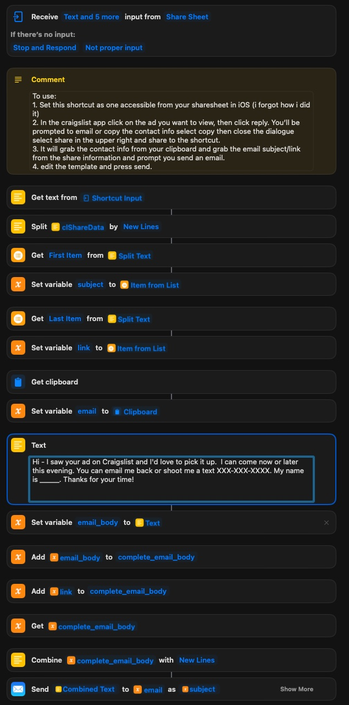

# basic_craigslist_scraper

this is a python script that will take any arbitrary link from craigslist, scrape it, and text you when new items appear. I use it to let me know when free items get posted but it could easily be deployed to watch for niche video game supplies. I have it deployed on a raspberry pi using headless ubuntu server 64bit, afaik the codebase would take some modification to work on other OS's. 


# Setup:

## Requirements

* A 64 bit raspberry pi running a 64 bit OS (ubuntu or similar)
* Python 3.9 - standalone or via [pyenv](https://github.com/pyenv/pyenv)
* firefox - `apt install firefox` *geckodriver included!*
* postgresql

once installed run `pip install -r requirements.txt`

### Postgrest setup

**NOTE:** If you already have postgres setup skip to step 4

1. Install with `apt install postgresql`
2. login to postgres `sudo -u postgres psql`
3. set the password `\password postgres`
4. create the database `CREATE DATABASE craigslist;`

Finally, update your `config.json` with your username and password (both are set to `postgres` by default)
### config set up:
there's an example config file stubbed out in `./config/configExample.json`. Most of the information should be self examplanatory. You'll want to save it as `./config/config.json` as that is where the script searches for it on start, unless you pass a different path (documented below in the `to run` section).

`urls`: The bot works by looking at the url every minute or so and then notifying you when things change, thus you need to use craigslist to generate a url. Go to your local craigslist website, search the item you want to watch for (in my case I just click on the free tag), and then use the filters on the left side of the browser to tune to tune your query. I always use the map to change my radius to my neighborhood since the default is a 60 miles which yields way too many notifications. Craigslist supports operators in it's search bar so you can also fine tune your search with [this syntax](https://www.craigslist.org/about/help/search). [Here's a reddit post with more detail about the syntax.](https://www.reddit.com/r/audiophile/comments/1x4r6i/a_guide_to_creating_craigslist_search_strings_to/). Be sure sort is set to chronological, sometimes mine will default to suggested.

`filters`: They match a word in the title surrounded by whitespace, not substrings, so adding "dirt" to the filters array would still notify you of listings with "dirty" in the title. The filters and titles are case insensitive. 

`email`: I initially wanted to get notified by email but found it to be slow. I believe the codebase would need work to support emails again, so you can just leave the email portion of the config file blank. 

`combine texts`: Just aggregates all the changes into one text so you don't get spammed. Is good when your query gets updated a lot.


### To run:
```sh
python main.py -c ./path/to/your/config
```
when the `-c` config path is not passed it's assumed to be `./config/config.json`

### control the scraper via text message:
first you'll need to set up a `serverConfig.json` in the `./config` directory. An example file stubbed there currently. The server config file is necessary because I am running the bot for several of my friends, through my single twilio number, and I wanted them to have a way to control the bot remotely. But to do that, I needed to associate their phone number with their unique config file. 

Install the additional dependencies:
```sh
pip install fastapi
pip install "uvicorn[standard]"
```

Set up `ngrok`. If you don't have an account/auth_token, you'll have to set one up. Instructions linked here: https://ngrok.com/download.


Run the `server.py` file, using 
```sh
uvicorn server:app --reload
```
open a new terminal. We're going to connect `ngrok` to our locally hosted fastapi instance, which is served by default on `http://127.0.0.1:8000/`.
```sh
ngrok http 8000
```
Now take the url that ngrok gives and go to the twilio console -> phone numbers -> manage -> active numbers -> the phone number -> message configuration and then paste in the ngrok link where it says "a message comes in (webhook) URL"

Available commands to text the bot are:
```
All commands are case insensitive. 

bstart - start the bot
bstop - stop the bot
re - restart the bot

h - print this help message

f <filter> - add a filter to the bot
rf <filter> - remove a filter from the bot
lf - list all filters
l <link> - add a link to the bot
ll - list all links
rl <index> - remove a link from the bot, use "ll" to see indexes

ct: toggle the combine texts.
```

### additional tidbit:
If you use an iPhone and the craigslist app, I wrote a iOS shortcut to quickly send a templated email to the poster. 

I had some trouble sharing the shortcut so you'll need to remake it yourself based on this picture. 




# Todo List:
- [ ] add the math to calculate the scraped time and the posted at (which cl presents as "4 mins ago") so timing can be correctly stored in the db. 
- [ ] Use Python package Fake User Agent to randomly generate a new user agent every request. 
- [ ] correct the database datatypes, right now they are all strings...
- [ ] make the scraped_at property a foreign key
- [ ] dockerize the script so it's easily deployable for others
- [ ] add the ability to kill all child process init'd by the server.


# Done
- [x] Use logging instead of prints (Fixed by connor, thank you!)
- [x] Allow the script to be managed via the user texting the twilio number e.g user can start and stop, add a new link, give filter keywords.
- [x] Add filter section to config, no more notifications about free dirt. 
- [x] create a parent scripts that can schedule and manage all the individual profiles in ./configs. (make an active directory in configs and put all the configs that need to be managed there)
- [x] Add a feature where all the texts will get added to a single text. 
- [x] parse config file using something like dataclass or pydantic so inputs are autovalidated
- [x] Use SQLAlchemy 2.0 feature where you can you db model as dataclass. [like this](https://docs.sqlalchemy.org/en/20/orm/dataclasses.html)
- [x] clean up the database interpolation. 
- [x] write the code to integrate with twilio to get notifications via sms. 
- [x] allow human readable csv files to be selected instead of database (maybe command line argument?)
- [x] change the scrape function to account for multiple urls in the craigslist url array in the config.json
- [x] save the time that the post was posted + include that in the text. 

## Docker (run anywhere)

This project now includes a Dockerfile and docker-compose to run the scraper and optional FastAPI control server without installing Firefox locally.

### Prereqs
- Docker Desktop or Docker Engine + Docker Compose
- A Postgres database (compose will start one for you)
- A config file at `./config/config.json` (use `config/configExample.json` as a template)

### Quick start with Compose

1) Create your config:
	 - Copy `config/configExample.json` to `config/config.json` and fill in values.
	 - If you want to use the text-command server, also create `config/serverConfig.json` based on `config/serverConfigExample.json`.

2) Start everything:

```sh
docker compose up --build -d
```

This will start:
- `db`: Postgres 14
- `scraper`: runs `python main.py --config ./config/config.json`
- `server`: runs `uvicorn server:app --host 0.0.0.0 --port 8000` exposed on port 8000

3) Logs:

```sh
docker compose logs -f scraper
```

### Configuration and environment

- The containerized app reads DB connection from env vars (overrides config values):
	- `DB_HOST`, `DB_PORT`, `DB_USER`, `DB_PASSWORD`, `DB_NAME`
	- Compose sets these to connect to the bundled Postgres service.
- Your local `./config` folder is mounted into the containers. Keep secrets in `config.json` locally; it’s ignored via `.dockerignore` so you don’t accidentally build them into the image.

### Running only the scraper
```sh
docker compose up --build -d db scraper
```

### Running only the API (control server)
```sh
docker compose up --build -d db server
```

### Twilio + ngrok for callbacks
If you use the text-command server, you’ll need a public URL. You can run ngrok on your host and point it to the server container’s published port:

```sh
ngrok http 8000
```

Then configure the Twilio webhook to the generated URL.

### Notes
- The Docker image includes Firefox ESR and geckodriver for Selenium in headless mode.
- The default image runs Python 3.10 to match the project’s requirements.